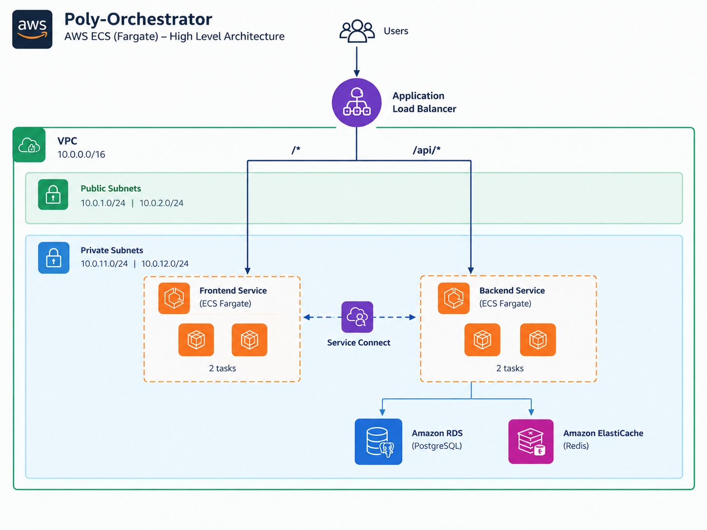
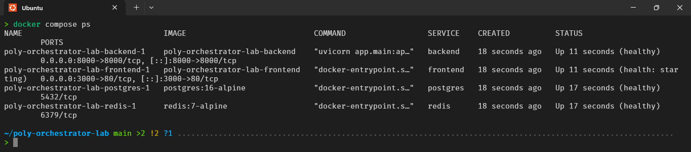
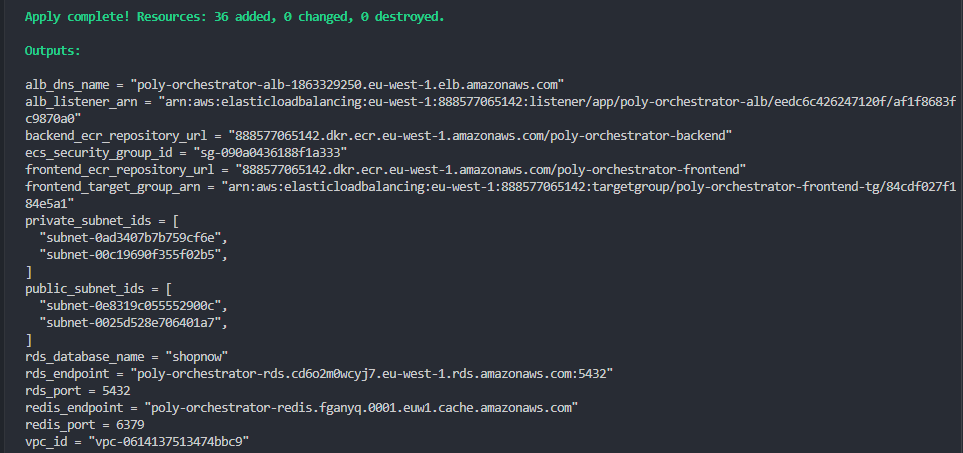
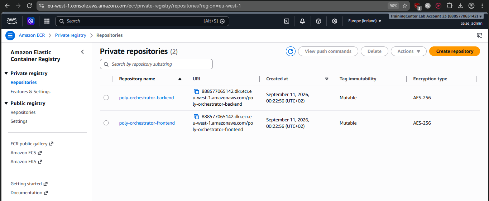
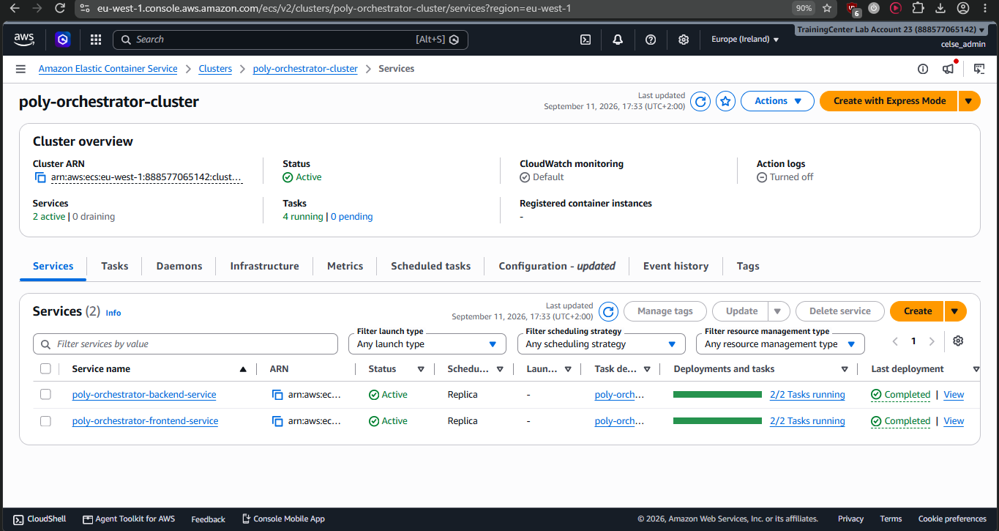
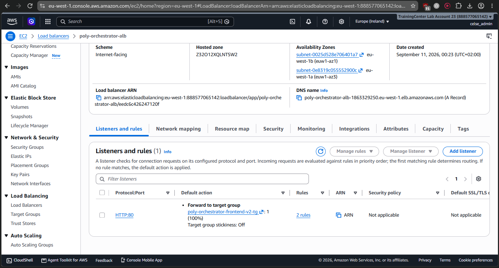
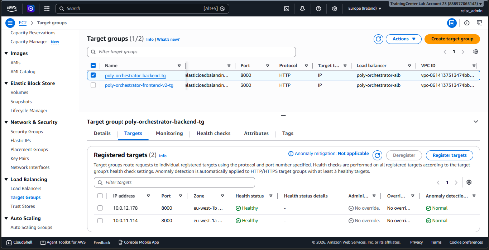
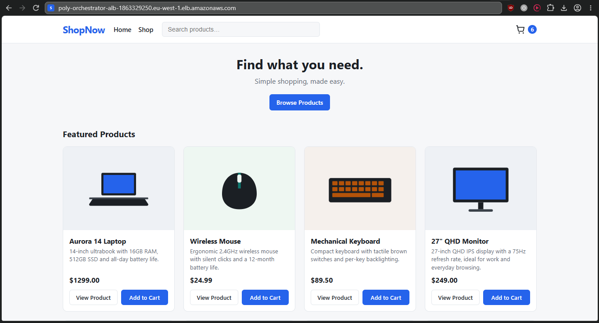

# Poly-Orchestrator — ShopNow on ECS and EKS

Poly-Orchestrator is a containerized three-tier e-commerce application ("ShopNow": Frontend, Backend API, PostgreSQL, Redis) deployed to **both Amazon ECS (Fargate) and Amazon EKS**, side by side, to compare the two orchestrators against the same application, container images, and data layer.

The project demonstrates how a multi-container application moves from a local Docker Compose environment to AWS using managed services such as **Amazon ECS, Amazon EKS, Amazon ECR, Application Load Balancer, Amazon RDS, ElastiCache Redis, and Terraform**.

Both deployments share the same RDS PostgreSQL instance, the same ElastiCache Redis instance, and the same container images (pushed once to ECR) - only the orchestration layer differs. Each does path-based routing (`/api/*` → backend, `/*` → frontend) through its own public Application Load Balancer: a manually-attached ALB for ECS, and an ALB automatically provisioned by the AWS Load Balancer Controller from a Kubernetes `Ingress` for EKS. The goal of the lab is to practice container deployment, AWS networking, service discovery, load balancing, and infrastructure provisioning with Terraform - and to compare the two orchestrators hands-on.

> **Live demo URLs (this session - both ALBs are ephemeral and will change on any redeploy):**
> - ECS: `http://poly-orchestrator-alb-2078397140.eu-west-1.elb.amazonaws.com/`
> - EKS: `http://k8s-shopnow-e8672dfd39-59190178.eu-west-1.elb.amazonaws.com/`
>
> Get the current ones any time with:
> ```bash
> terraform -chdir=terraform output -raw alb_dns_name
> kubectl get ingress -n shopnow shopnow-ingress-frontend -o jsonpath='{.status.loadBalancer.ingress[0].hostname}'
> ```

## Architecture



The application is deployed inside an AWS VPC using ECS Fargate. An internet-facing Application Load Balancer provides the public entry point and routes frontend and API traffic to their respective ECS services.

The frontend communicates with the backend through ECS Service Connect. The backend privately accesses Amazon RDS PostgreSQL for persistent data and Amazon ElastiCache Redis for caching. The ECS tasks and data services are deployed in private subnets, while the ALB is placed in public subnets.

## 1. Containerization & Local Testing

The frontend and backend were containerized using Docker, with Docker Compose used to run the complete application locally.

```bash
docker compose up --build
```

The local environment consists of:

```text
Frontend
Backend
PostgreSQL
Redis
```



---

## 2. Infrastructure with Terraform

Terraform was used to provision the AWS infrastructure required by the application.

The infrastructure includes:

* VPC and subnets
* Internet Gateway and NAT Gateway
* Security groups
* ECR repositories
* Application Load Balancer
* RDS PostgreSQL
* ElastiCache Redis

```bash
cd terraform
terraform init
terraform plan
terraform apply
```



---

## 3. Amazon ECR

The frontend and backend Docker images were pushed to separate Amazon ECR repositories.

```text
poly-orchestrator-frontend
poly-orchestrator-backend
```

Versioned image tags were used for deployment.



---

## 4. ECS Deployment

The application was deployed to an ECS cluster using AWS Fargate.

Two services were created:

```text
poly-orchestrator-frontend-service
poly-orchestrator-backend-service
```

Each service runs two tasks for basic redundancy.

The frontend listens on port `3000`, while the backend listens on port `8000`.



---

## 5. Load Balancing & Service Connect

The Application Load Balancer routes traffic based on the request path:

```text
/api/*  → Backend :8000
/*      → Frontend :3000
```

ECS Service Connect also registers the backend as `backend:8000`, a Cloud-Map-backed internal DNS name any Service-Connect-enabled task in the cluster can resolve - this is the "frontend talks to backend via service discovery" mechanism the lab asks for, alongside the ALB (which both frontend and backend also sit behind, for convenience and for the load-balancing objective). Confirmed active via:

```bash
aws ecs describe-services --cluster poly-orchestrator-cluster \
  --services poly-orchestrator-backend-service \
  --query 'services[0].deployments[0].serviceConnectConfiguration'
```
```json
{
  "enabled": true,
  "namespace": "arn:aws:servicediscovery:eu-west-1:...:namespace/ns-c6sidfwsoknjeqi7",
  "services": [{"portName": "backend", "discoveryName": "backend",
                "clientAliases": [{"port": 8000, "dnsName": "backend"}]}]
}
```

(The equivalent EKS mechanism - a pod resolving a Kubernetes Service by DNS name - is demonstrated live in the EKS section below.)

The backend then connects privately to:

```text
RDS PostgreSQL :5432
ElastiCache Redis :6379
```



---

## 6. Final Validation

The deployed application was accessed through the ALB DNS name.

The following were verified:

* Frontend loads successfully
* Backend API responds through `/api/products`
* Frontend communicates with the backend
* Backend connects to PostgreSQL
* Redis caching works
* ALB target groups report healthy ECS tasks





---

## 7. Troubleshooting

During deployment, several issues were encountered and resolved:

* Frontend Nginx returned `502 Bad Gateway`, so API routing was moved to the ALB.
* The frontend target group could not reach port `3000` because of a missing security-group rule.
* The backend target group could not reach port `8000` for the same reason.
* The backend target group initially had no targets because it was not attached to the ECS service.

These issues highlighted the importance of correctly aligning **ECS port mappings, target groups, ALB rules, health checks, and security groups**.

---

## 8. Lessons Learned

* ECS services, ALB target groups, and security groups must be configured consistently.
* An ALB `503` can indicate that there are no healthy targets rather than an application failure.
* Service Connect is useful for internal ECS service communication, while the ALB handles external traffic.
* Managed services such as RDS and ElastiCache reduce the infrastructure that must be managed inside ECS.
* ECS Fargate allows containers to run without managing the underlying servers.

---

## 9. EKS Deployment

The same application - same container images, same RDS/ElastiCache instances - is also deployed to an EKS cluster, to compare directly against the ECS deployment above.

**Infrastructure** (`terraform/eks.tf`): an EKS cluster (`poly-orchestrator-eks`, Kubernetes 1.31) with one managed EC2 node group (2× `t3.medium`, on-demand) in the same private subnets as the ECS tasks/RDS/ElastiCache. IRSA (IAM Roles for Service Accounts) is enabled and used to grant the AWS Load Balancer Controller the permissions it needs, without putting AWS credentials in any pod.

**Kubernetes manifests** (`k8s/`):

```text
00-namespace.yaml            Namespace "shopnow"
10-backend-configmap.yaml    Non-secret backend config (DB/Redis host, port, ...)
11-backend-deployment.yaml   Backend Deployment (2 replicas) + Service (ClusterIP)
20-frontend-deployment.yaml  Frontend Deployment (2 replicas) + Service (ClusterIP)
30-ingress.yaml              Two Ingress resources sharing one ALB (see below)
```

The `DATABASE_PASSWORD` secret is created imperatively at deploy time, not committed:
```bash
kubectl create secret generic backend-secret -n shopnow \
  --from-literal=DATABASE_PASSWORD=<same value as terraform.tfvars db_password>
```

**Service discovery**: a plain Kubernetes `Service` (ClusterIP) gives DNS-based service discovery for free via CoreDNS - no extra configuration needed, unlike ECS's Cloud Map/Service Connect setup. Verified live:

```bash
kubectl exec -n shopnow deploy/frontend -- wget -qO- http://backend:8000/health
# {"status":"healthy"}
```

**Load balancing / Ingress**: the [AWS Load Balancer Controller](https://kubernetes-sigs.github.io/aws-load-balancer-controller/) is installed via Helm, using the IRSA role from `eks.tf`'s `lb_controller_irsa` module:

```bash
aws eks update-kubeconfig --name poly-orchestrator-eks --region eu-west-1 --profile sandbox-user

helm install aws-load-balancer-controller <chart> -n kube-system \
  --set clusterName=poly-orchestrator-eks \
  --set region=eu-west-1 \
  --set vpcId=$(terraform -chdir=terraform output -raw vpc_id) \
  --set serviceAccount.create=true \
  --set serviceAccount.name=aws-load-balancer-controller \
  --set serviceAccount.annotations."eks\.amazonaws\.com/role-arn"=$(terraform -chdir=terraform output -raw eks_lb_controller_role_arn)
```

It watches `Ingress` objects and provisions a real ALB automatically. `k8s/30-ingress.yaml` mirrors the ECS ALB's path-based routing exactly (`/api/*` → backend, `/*` → frontend), split into **two** `Ingress` resources sharing one ALB via `alb.ingress.kubernetes.io/group.name` - each backend needs a different health-check path (`/health` for the backend, `/` for the frontend), and that annotation applies per-Ingress rather than per-rule.

Once the Ingress's ALB is provisioned (`kubectl get ingress -n shopnow`), the app is reachable the same way as the ECS deployment:

```bash
curl http://<ingress-alb-dns-name>/            # frontend
curl http://<ingress-alb-dns-name>/api/products  # backend, via the same origin
```

**Why the frontend image needs no changes between ECS and EKS**: it's built once with `VITE_API_BASE_URL=""` (relative `/api/*` calls). Both the ECS ALB and the EKS Ingress do the same path-based routing in front of it, so the browser always calls its own origin regardless of which orchestrator is serving it.

---

## 10. Resiliency

Both orchestrators were tested by manually killing a running backend instance and confirming automatic recovery, with no manual intervention:

**ECS** - stop a running task directly:
```bash
aws ecs stop-task --cluster poly-orchestrator-cluster --task <task-id> \
  --reason "Resiliency demo: manual kill"
```
Result: the service scheduler started a replacement task within seconds and `runningCount` returned to the desired count of 2, confirmed via `aws ecs list-tasks` (a new task ID replaced the stopped one) and the ALB target group returning to 2 healthy targets.

**EKS** - delete a running pod directly:
```bash
kubectl delete pod <backend-pod-name> -n shopnow
```
Result: the Deployment's ReplicaSet created a replacement pod immediately; it reached `1/1 Ready` about 20 seconds later. `kubectl get pods -n shopnow -l app=backend` showed the new pod name/age in place of the deleted one, with the other replica never interrupted.

In both cases the application kept serving traffic throughout, since each orchestrator always kept at least one healthy replica running behind its load balancer.

---

## 11. ECS vs EKS - Comparison

| | ECS (Fargate) | EKS |
|---|---|---|
| Setup complexity | Low - cluster is a single resource, task defs are a JSON blob | Higher - cluster + node group + IRSA + a separate Ingress controller to install |
| Time to a running app (this lab) | ~3 minutes from `terraform apply` to steady state (control plane is instant; only image pull + health checks gate it) | ~10-12 minutes (EKS control plane alone takes ~8-10 min to become active, before any workload can even be scheduled) |
| Compute model | Serverless per-task (Fargate) - no nodes to size or patch | Node group of EC2 instances to size, patch and pay for whether or not pods are using them |
| Service discovery | Cloud Map / Service Connect - an explicit resource + per-service configuration | Built into the platform - any `Service` gets a DNS name via CoreDNS for free |
| Load balancing / Ingress | Native ALB integration (`load_balancer` block on the service) | Requires installing and operating a separate controller (AWS Load Balancer Controller) to translate `Ingress` objects into ALBs |
| Scaling primitive | ECS Service `desiredCount` / Application Auto Scaling | Deployment `replicas` / Horizontal Pod Autoscaler |
| Self-healing (observed) | Scheduler replaces a stopped task in seconds | ReplicaSet replaces a deleted pod in seconds |
| Portability | AWS-specific API and tooling | Standard Kubernetes API - same manifests would run on any conformant cluster (on-prem, another cloud) |
| Operational surface | Smaller - AWS manages the control plane and the "nodes" | Larger - cluster upgrades, node AMI/patch cycles, add-ons (CoreDNS, VPC CNI, the LB controller) are all the operator's responsibility |

**Takeaway for ShopNow**: ECS/Fargate got a working, self-healing deployment up faster with fewer moving parts, and needs no separate controller for load balancing or service discovery. EKS took longer to stand up and requires operating more components (node group, IRSA, the LB controller), but gives standard Kubernetes portability and a much larger ecosystem (Helm charts, operators, HPA/VPA, service meshes) if ShopNow's needs grow beyond what ECS's simpler model covers.

---

## Project Structure

```text
poly-orchestrator-lab/
├── backend/
├── frontend/
├── k8s/            # EKS manifests: namespace, configmap, deployments, services, ingress
├── terraform/       # VPC, ALB, ECR, RDS, ElastiCache, ECS cluster/services, EKS cluster/node group
├── docs/
├── docker-compose.yml
└── README.md
```
