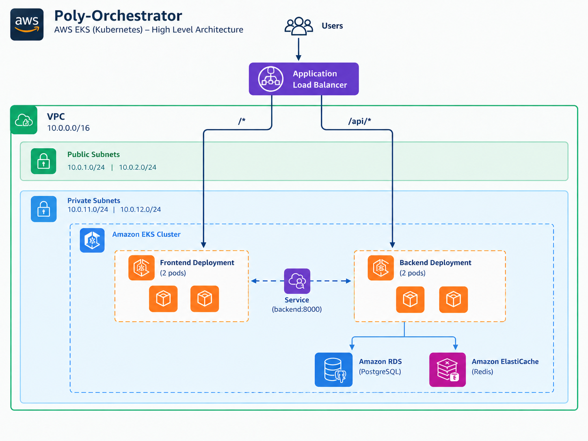
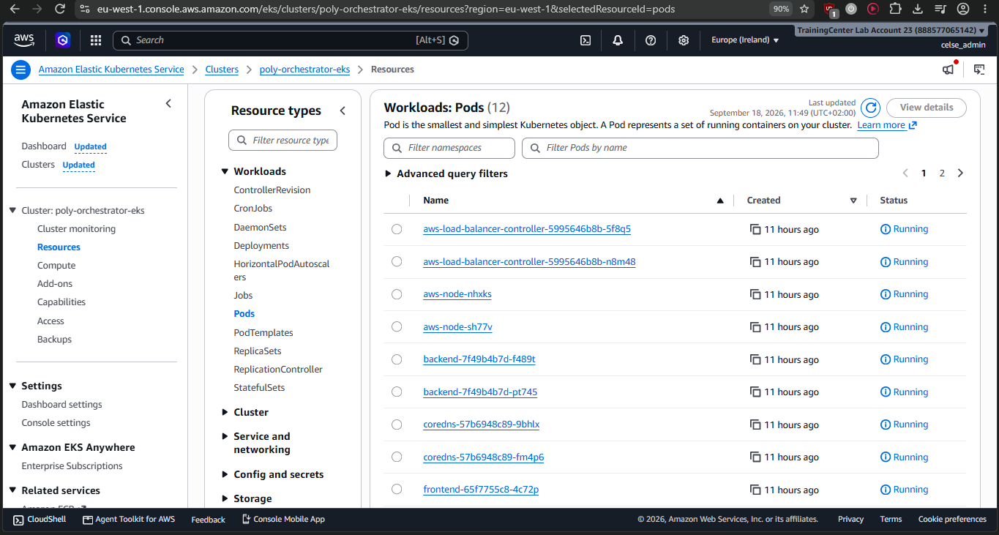
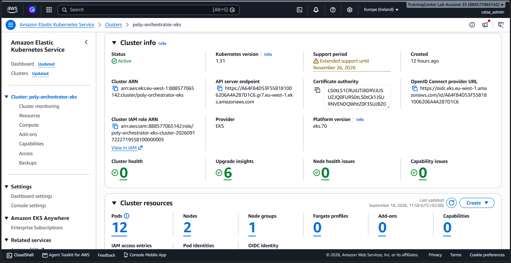
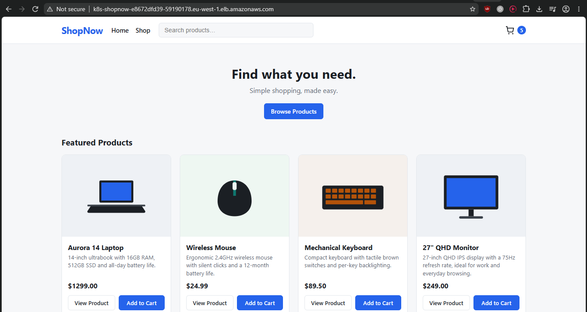

# Poly-Orchestrator — ShopNow on ECS and EKS

ShopNow is a three-tier e-commerce app (Frontend, Backend API, PostgreSQL, Redis) deployed twice on AWS, once on **ECS Fargate** and once on **EKS**, to compare the two orchestrators side by side. Both deployments run the same container images and share the same RDS and ElastiCache instances — only the orchestration layer differs.

> **Live demo URLs** (ephemeral, change on every redeploy)
> - ECS: `http://poly-orchestrator-alb-738163693.eu-west-1.elb.amazonaws.com/`
> - EKS: `http://k8s-shopnow-shopnowg-0ddd7324c9-1767495191.eu-west-1.elb.amazonaws.com/`
>
> ```bash
> terraform -chdir=terraform output -raw alb_dns_name
> kubectl get gateway shopnow-gateway -n shopnow -o jsonpath='{.status.addresses[0].value}'
> ```

## Local Development

The frontend and backend are containerized with Docker. `docker-compose.yml` runs the full stack locally: frontend, backend, PostgreSQL, Redis.

```bash
docker compose up --build
```


## Infrastructure

Terraform provisions the shared foundation both orchestrators run on:

* VPC, public/private subnets, NAT gateway
* Security groups
* ECR repositories (frontend, backend)
* Application Load Balancer
* RDS PostgreSQL
* ElastiCache Redis

```bash
cd terraform
terraform init
terraform plan
terraform apply
```


Frontend and backend images are built once and pushed to ECR, then reused by both the ECS and EKS deployments below.

```text
poly-orchestrator-frontend
poly-orchestrator-backend
```


## ECS (Fargate)

### Architecture


The frontend and backend each run as an ECS Fargate service in private subnets. A public Application Load Balancer routes `/*` to the frontend and `/api/*` to the backend. Internally, the frontend can also reach the backend by name (`backend:8000`) over ECS Service Connect, which is backed by Cloud Map.

### What we implemented

* ECS cluster with two services (frontend, backend), two tasks each
* ALB with path-based routing to both services
* Service Connect for internal service discovery
* Backend connects privately to RDS and ElastiCache

### How it was implemented

Cluster, task definitions, and services are all defined in `terraform/ecs.tf` — nothing is created manually. `terraform apply` provisions the cluster, registers both task definitions against the ECR images, and creates both services with Service Connect enabled. The ALB target groups and the `/api/*` listener rule live in `terraform/alb.tf`.

```bash
aws ecs describe-services --cluster poly-orchestrator-cluster \
  --services poly-orchestrator-backend-service poly-orchestrator-frontend-service
```


## EKS

### Architecture



The frontend and backend each run as a Kubernetes Deployment on a managed EC2 node group. A `Service` gives each one a stable internal DNS name via CoreDNS. The AWS Load Balancer Controller watches a `Gateway` and `HTTPRoute` and provisions a public ALB with the same `/*` and `/api/*` routing as the ECS side.

### What we implemented

* EKS cluster with a managed node group (2× t3.medium)
* Frontend and backend Deployments, two pods each
* ClusterIP Services for internal DNS-based discovery
* AWS Load Balancer Controller + Gateway API (GatewayClass, Gateway, HTTPRoute) for external routing
* Backend connects to the same RDS and ElastiCache instances as ECS

### How it was implemented

The cluster, node group, and the IAM role for the AWS Load Balancer Controller are defined in `terraform/eks.tf`. Once the cluster is up, the Gateway API CRDs and the controller are installed, then the manifests in `k8s/` are applied directly with `kubectl`.

```bash
aws eks update-kubeconfig --name poly-orchestrator-eks --region eu-west-1

kubectl apply --server-side -f https://github.com/kubernetes-sigs/gateway-api/releases/download/v1.6.1/standard-install.yaml

helm install aws-load-balancer-controller <chart> -n kube-system \
  --set clusterName=poly-orchestrator-eks --set region=eu-west-1

kubectl apply -f k8s/
```

The AWS Load Balancer Controller supports Gateway API out of the box (it auto-detects the CRDs above at startup) — its own CRDs for target group and load balancer settings (`TargetGroupConfiguration`, `LoadBalancerConfiguration`) ship inside its Helm chart, so only the upstream Gateway API CRDs need installing separately.

Service discovery needs no extra setup — any pod can already reach the backend by its Service name:

```bash
kubectl exec -n shopnow deploy/frontend -- wget -qO- http://backend:8000/health
```

Ingress used to need two objects sharing one ALB, because its `healthcheck-path` annotation applies per-Ingress, not per backend. Gateway API's `TargetGroupConfiguration` sets the health check per Service instead, so `k8s/30-gateway.yaml` needs only one `Gateway` and one `HTTPRoute` (with a `TargetGroupConfiguration` for each of the two Services).







## Resiliency

Both orchestrators were tested by manually killing a running backend instance.

**ECS**: stopped a task directly (`aws ecs stop-task`). The service scheduler started a replacement within seconds and `runningCount` went back to 2.

**EKS**: deleted a running pod directly (`kubectl delete pod`). The Deployment's ReplicaSet created a replacement, ready again in about 20 seconds.

The app kept serving traffic throughout on both, since each orchestrator always kept at least one healthy replica behind its load balancer.

## Comparison

| | ECS (Fargate) | EKS |
|---|---|---|
| Setup | Cluster, task defs and services are plain Terraform resources | Cluster, node group, IRSA role, and the Gateway API CRDs + LB controller to install |
| Time to a running app | A few minutes — control plane is instant | 10-12 minutes — the EKS control plane alone takes 8-10 minutes to come up |
| Compute | Serverless per task, no nodes to manage | EC2 node group you size and patch yourself |
| Service discovery | Cloud Map / Service Connect, configured per service | Built in — any Service gets a DNS name from CoreDNS |
| Load balancing | Native ALB integration on the service | Needs the AWS Load Balancer Controller to turn Gateway/HTTPRoute objects into ALBs |
| Scaling | ECS desired count / Application Auto Scaling | Deployment replicas / Horizontal Pod Autoscaler |
| Self-healing | Scheduler replaces a stopped task in seconds | ReplicaSet replaces a deleted pod in seconds |
| Portability | AWS-specific | Standard Kubernetes API, portable to other clusters |
| Ops overhead | Lower — AWS manages the control plane and compute | Higher — cluster upgrades, node patching, and add-ons are on you |

For ShopNow, ECS got a working deployment up faster with fewer moving parts. EKS took longer to stand up and needs more components to operate, but gives standard Kubernetes portability if that becomes worth the extra overhead.
