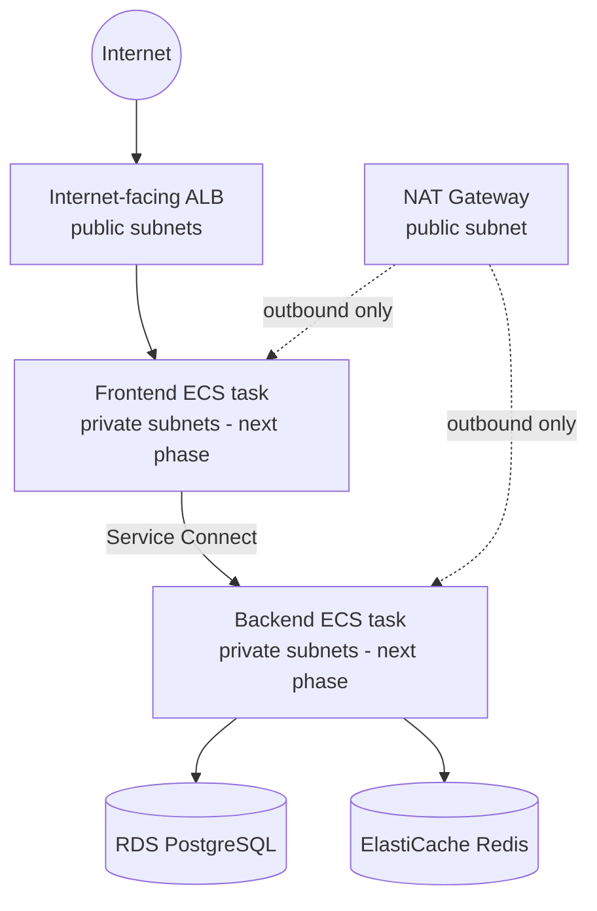

# ShopNow — AWS infrastructure (Terraform)

This provisions the full AWS foundation plus **both** orchestrators: the network
(VPC, subnets, ALB, ECR, RDS, ElastiCache, security groups), an ECS Fargate
cluster with Service Connect (`ecs.tf`), and an EKS cluster with a managed node
group and the IRSA role for the AWS Load Balancer Controller (`eks.tf`). See the
root `README.md` for the full ECS and EKS deployment walkthrough, including the
Kubernetes manifests in `../k8s/` (which this configuration doesn't apply -
that's `kubectl`'s job, same as `docker push` is for the container images).

An earlier version of this lab kept ECS out of Terraform deliberately, to learn
the concepts hands-on via the console/CLI first. It's back in Terraform now so
the whole stack - including ECS - can be torn down and rebuilt reproducibly
(this rebuild is exactly what happened after a sandbox prune deleted
everything the first version of this file's resources had created).

## Architecture

```text
                              INTERNET
                                 │
                                 ▼
                         ┌───────────────┐
                         │  Public ALB   │  (public subnets, both AZs)
                         └───────┬───────┘
                                 │ :80
                                 ▼
                     Frontend ECS Fargate task      ┐
                                 │                   │  private subnets
                          Service Connect            │  (created next phase,
                                 ▼                   │   not by Terraform)
                     Backend ECS Fargate task        ┘
                          │            │
                     :5432│            │:6379
                          ▼            ▼
                  RDS PostgreSQL   ElastiCache Redis
                  (private subnets, no public access)
```



## What this creates

| Area | Resource(s) | Module / native |
|---|---|---|
| Networking | VPC, 2 public + 2 private subnets, IGW, 1 NAT Gateway, route tables | `terraform-aws-modules/vpc/aws` |
| Container registry | 2 private ECR repos (frontend, backend), image scan on push, lifecycle policy | `terraform-aws-modules/ecr/aws` |
| Load balancing | Internet-facing ALB, frontend target group (`target_type = ip`), HTTP:80 listener | native |
| Database | RDS PostgreSQL, single-AZ, private subnets only | native |
| Cache | ElastiCache Redis, single node, private subnets only | native |
| Security | 4 security groups (ALB, ECS, RDS, Redis) | native |

Modules are used only where the Terraform Registry module is clearly better than
hand-rolling it (VPC networking plumbing, ECR repository + lifecycle policy
boilerplate). RDS, ElastiCache, the ALB and the security groups are small enough
in this lab that native resources stay more readable than wrapping them in a
general-purpose module with dozens of unused inputs.

## VPC design

- CIDR `10.0.0.0/16` across 2 AZs (`eu-west-1a`, `eu-west-1b`).
- **Public subnets** (`10.0.1.0/24`, `10.0.2.0/24`): hold the ALB and the NAT
  Gateway. The ALB is the one thing in this architecture that must be reachable
  from the internet.
- **Private subnets** (`10.0.11.0/24`, `10.0.12.0/24`): hold the ECS tasks
  (next phase), RDS and ElastiCache. None of these should ever be directly
  internet-reachable.
- DNS support and DNS hostnames are enabled on the VPC because ECS Service
  Connect / Cloud Map service discovery depends on DNS resolution working inside
  the VPC.

### Why one NAT Gateway?

Private ECS tasks need outbound internet access to pull container images from
ECR and reach required AWS endpoints (STS, CloudWatch Logs, etc.). One NAT
Gateway is enough for this lab and keeps cost down — a NAT Gateway per AZ would
double that cost for redundancy this lab doesn't need. Production HA designs
would typically use one NAT Gateway per AZ so that losing one AZ doesn't take
down egress for the other.

## Security groups

```text
Internet --80--> [ALB SG] --80--> [ECS SG] <--Service Connect--> [ECS SG]
                                      │                              │
                                    5432                           6379
                                      ▼                              ▼
                                  [RDS SG]                     [Redis SG]
```

- **ALB SG**: inbound `80/tcp` from `0.0.0.0/0`; this is the only security group
  open to the internet in the whole stack.
- **ECS SG**: inbound `80/tcp` only from the ALB SG (frontend traffic), plus a
  self-referencing rule allowing the full TCP range between members of the same
  group — Service Connect assigns ports per task/proxy rather than one fixed
  port, so a single SG shared by frontend and backend tasks with an intra-group
  rule is simpler and just as tight as enumerating exact ports.
- **RDS SG**: inbound `5432/tcp` only from the ECS SG. Never `0.0.0.0/0`.
- **Redis SG**: inbound `6379/tcp` only from the ECS SG. Never `0.0.0.0/0`.

## Why RDS instead of PostgreSQL in ECS?

PostgreSQL is stateful. RDS provides managed persistence, automated backups,
patching and failover primitives that would otherwise have to be reimplemented
around a containerized database. Keeping it out of ECS also means the app
containers stay fully stateless and disposable — exactly what Fargate is good at.

## Why ElastiCache instead of Redis in ECS?

Same reasoning as RDS: Redis here is a cache, and a managed cache node means its
lifecycle (patching, failure recovery) is decoupled from application container
deployments. The backend already treats Redis as fail-soft (falls back to
PostgreSQL if the cache is unreachable), which pairs well with a managed,
independently-lifecycled cache tier.

## Why private subnets for ECS/RDS/ElastiCache?

None of these need to accept inbound connections from the public internet. The
ALB is the only intended entry point; everything behind it should be
unreachable except through the security-group chain above.

## Why public subnets for the ALB?

The ALB is the public entry point to the application, so it must live where it
can hold public/internet-routable addressing and be reached by clients directly.

## Why isn't ECS in this Terraform configuration?

By design for this phase of the lab: ECS cluster, task definitions, services,
Service Connect and Cloud Map are configured manually next, so those concepts
are learned by doing them in the console rather than having Terraform generate
them. This configuration only provisions what ECS will depend on.

## A note on the database password and Terraform state

`db_password` is passed in as a Terraform variable and is written into
`aws_db_instance.this` — which means **it will be present in Terraform state**
(`terraform.tfstate`), in plaintext, as it is for any Terraform-managed RDS
password. For this lab:

- State is local (no remote backend configured) and `.tfstate` is gitignored —
  it must never be committed.
- Treat `terraform.tfstate` as sensitive; do not share it outside the lab.
- For anything beyond a lab, prefer a remote backend with encryption (e.g. S3 +
  KMS) and/or letting RDS manage the password via AWS Secrets Manager
  (`manage_master_user_password = true`) instead of passing it as a plain
  variable.

## Outputs

| Output | Used for |
|---|---|
| `vpc_id`, `public_subnet_ids`, `private_subnet_ids` | ECS networking config next phase |
| `ecs_security_group_id` | Attach to ECS task ENIs next phase |
| `frontend_ecr_repository_url`, `backend_ecr_repository_url` | `docker push` targets, task definition image URIs |
| `alb_dns_name` | Browser URL for the deployed app |
| `frontend_target_group_arn` | ECS frontend service's `load_balancer` target group |
| `alb_listener_arn` | Reference/verification only |
| `rds_endpoint`, `rds_port`, `rds_database_name` | Backend `DATABASE_HOST`/`DATABASE_PORT`/`DATABASE_NAME` env vars next phase |
| `redis_endpoint`, `redis_port` | Backend `REDIS_HOST`/`REDIS_PORT` env vars next phase |

The database password is deliberately never output.

## Usage

```bash
cd terraform
cp terraform.tfvars.example terraform.tfvars   # then edit db_password locally

# Confirm you're pointed at the right identity/account before touching anything:
aws sts get-caller-identity --profile sandbox-user

terraform init
terraform fmt -recursive
terraform validate
terraform plan
# Review the plan output carefully, then:
terraform apply
```

To tear everything down when the lab is finished:

```bash
terraform destroy
```

This deletes the VPC, ALB, RDS instance (final snapshot is skipped — see
`rds.tf`) and ElastiCache node. It does **not** delete the ECR repositories'
images or anything created manually in the ECS phase; clean those up separately.
